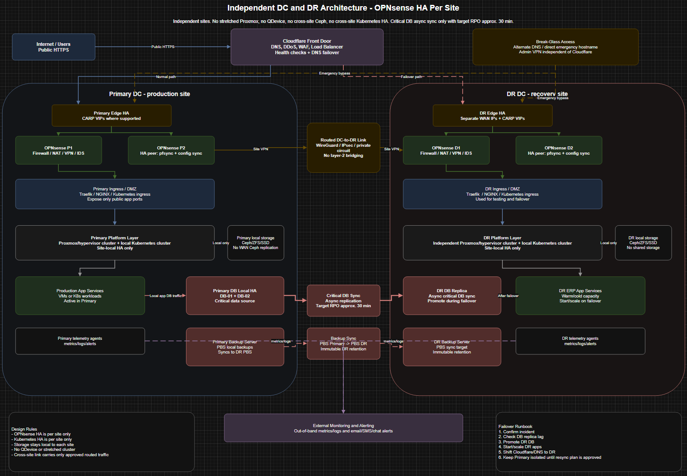

# Disaster Recovery Plan

## Independent DC and DR Architecture

This document describes the target disaster recovery design for the Kubernetes platform. The design uses two independent sites: a Primary DC and a DR DC.

The current lab environment is a single-site Kubernetes deployment. This DR plan is documented as a future production-style extension.

---

## Architecture Diagram



*Figure 1. Independent DC and DR architecture with site-local OPNsense HA, separate Kubernetes/storage per site, routed DC-to-DR connectivity, async database replication, backup synchronization, Cloudflare failover, and break-glass access.*

---

## Executive Summary

The DR design separates the Primary DC and DR DC into independent failure domains.

Each site has its own:

* OPNsense HA pair;
* Proxmox or hypervisor cluster;
* local storage;
* Kubernetes cluster;
* ingress layer;
* backup service.

The sites are connected using a routed site-to-site link. The design intentionally avoids stretched Proxmox, stretched Ceph, QDevice, and cross-site Kubernetes HA.

Only critical data should be replicated across sites. The main near-real-time replication path is the database.

Target objectives:

| Item             | Target                                           |
| ---------------- | ------------------------------------------------ |
| RPO              | Approximately 30 minutes                         |
| RTO              | Approximately 1–2 hours for manual DR activation |
| Failover model   | Manual or controlled failover                    |
| Site model       | Independent Primary and DR sites                 |
| Storage model    | Site-local storage only                          |
| Kubernetes model | One Kubernetes cluster per site                  |

---

## Design Goals

| Area               | Decision                                                            |
| ------------------ | ------------------------------------------------------------------- |
| Availability model | Independent Primary and DR sites with manual or controlled failover |
| Firewall model     | Two-node OPNsense HA pair in each site                              |
| Storage model      | Site-local storage only                                             |
| Kubernetes model   | One Kubernetes cluster per site                                     |
| Database model     | Primary database with async replication to DR                       |
| Backup model       | Primary backup server with synchronized DR backup copy              |
| Public access      | Cloudflare DNS, proxy, WAF, health checks, and failover             |
| Break-glass access | Alternate DNS or VPN path independent of Cloudflare                 |

Explicit non-goals:

* no stretched Proxmox cluster;
* no QDevice between sites;
* no cross-site Ceph cluster;
* no cross-site Kubernetes control plane;
* no layer-2 bridging across the DC-to-DR link.

---

## Public Traffic Flow

Normal public access:

```text
Users
  -> Cloudflare
  -> Primary OPNsense edge
  -> Primary ingress
  -> Primary application services
```

DR failover access:

```text
Users
  -> Cloudflare failover / DNS change
  -> DR OPNsense edge
  -> DR ingress
  -> DR application services
  -> Promoted DR database
```

Break-glass access:

```text
Admins
  -> Alternate DNS or VPN
  -> Primary or DR OPNsense
  -> Internal management networks
```

Cloudflare is used for public traffic steering, DDoS protection, WAF, and health checks. It is not the only DR access method. Emergency access should exist through VPN or alternate DNS.

---

## Private Site-to-Site Traffic

The DC-to-DR connection is routed, not bridged. It may use WireGuard, IPsec, a private WAN, or a dedicated circuit.

Only approved traffic should cross the site-to-site link.

| Traffic                | Direction                                 | Purpose                                              |
| ---------------------- | ----------------------------------------- | ---------------------------------------------------- |
| Database replication   | Primary DB to DR DB                       | Critical data sync with target RPO around 30 minutes |
| Backup sync            | Primary backup server to DR backup server | DR backup copy and retention                         |
| Monitoring/logging     | Both sites to external monitoring         | Health visibility and alerting                       |
| Admin traffic          | VPN/admin subnet to internal networks     | Maintenance and emergency access                     |
| Registry/artifact sync | Optional controlled path                  | Keep DR deployable without depending only on Primary |

---

## OPNsense Firewall Design

Each site uses its own local OPNsense HA pair.

| Site       | Node 1      | Node 2      | HA Behavior                                             |
| ---------- | ----------- | ----------- | ------------------------------------------------------- |
| Primary DC | OPNsense P1 | OPNsense P2 | CARP VIPs, pfsync, and config sync for the Primary site |
| DR DC      | OPNsense D1 | OPNsense D2 | CARP VIPs, pfsync, and config sync for the DR site      |

Firewall principles:

* keep OPNsense HA local to each site;
* do not stretch firewall HA between DC and DR;
* expose only required public application ports;
* keep OPNsense GUI and SSH private behind VPN or management networks;
* do not expose Proxmox, Kubernetes API, database, or backup services to the public internet;
* use explicit site-to-site rules for database replication, backup sync, monitoring, and admin traffic.

---

## Hypervisor and Storage Design

Each site has its own independent hypervisor and storage stack.

| Component          | Primary DC                                    | DR DC                                            |
| ------------------ | --------------------------------------------- | ------------------------------------------------ |
| Hypervisor         | Primary site-local Proxmox/hypervisor cluster | Independent DR hypervisor cluster                |
| Storage            | Local Ceph/ZFS/SSD storage                    | Local Ceph/ZFS/SSD storage                       |
| VM recovery        | Local backups and synced DR copies            | Restore or run standby workloads during failover |
| Cross-site storage | Not stretched                                 | Not shared                                       |

Storage remains local to each site. The design avoids WAN-sensitive storage and quorum designs.

---

## Kubernetes Design

The design uses one Kubernetes cluster per site.

| Topic         | Primary Kubernetes                                 | DR Kubernetes                             |
| ------------- | -------------------------------------------------- | ----------------------------------------- |
| HA scope      | HA inside Primary site only                        | HA inside DR site only                    |
| Workloads     | Production workloads active under normal operation | Warm/cold workloads for failover          |
| Ingress       | Primary ingress behind Primary edge                | DR ingress behind DR edge                 |
| Stateful data | Uses Primary database                              | Uses promoted DR database after failover  |
| Deployment    | CI/CD deploys to Primary                           | CI/CD should also be able to deploy to DR |

Kubernetes is not stretched across sites. DR application manifests, secrets strategy, registry access, and deployment steps should be tested regularly.

---

## Database Replication and RPO

The database is the main critical cross-site replication path.

The Primary DC runs the active database. The DR DC keeps an async replica.

Target:

```text
RPO: approximately 30 minutes
```

Requirements:

* use private-network or TLS-protected replication;
* monitor replication lag;
* alert when lag approaches or exceeds the RPO target;
* document how to promote the DR replica;
* point DR applications to the promoted database during failover;
* keep separate database backups because replication is not a replacement for backup.

Failure behavior:

| Scenario                 | Expected Response                                                                     |
| ------------------------ | ------------------------------------------------------------------------------------- |
| Primary app failure      | Shift traffic to DR app tier if DR app and database are ready                         |
| Primary database failure | Use local DB HA first; promote DR database only for wider failure                     |
| DC-to-DR link failure    | Primary continues running; DR lag increases and alerts fire                           |
| Bad data or corruption   | Restore from backup or point-in-time recovery, because replication may copy the issue |

---

## Backup and Restore Design

| Layer            | Primary DC                                                         | DR DC                                         |
| ---------------- | ------------------------------------------------------------------ | --------------------------------------------- |
| VM/app backups   | Primary backup server takes local backups                          | DR backup server receives synchronized copies |
| Database backups | Regular database backups and point-in-time recovery where possible | Restore copies available in DR                |
| Retention        | Local retention for quick restore                                  | DR retention with immutability where possible |
| Restore testing  | Test local restore regularly                                       | Test DR restore regularly                     |

Backups must be tested by performing actual restores. Backup job success alone is not enough.

---

## Cloudflare and Break-Glass Access

Cloudflare is the normal public entry point.

Normal mode:

```text
Users -> Cloudflare -> Primary DC
```

DR mode:

```text
Users -> Cloudflare failover -> DR DC
```

Break-glass mode:

```text
Admins -> VPN or alternate DNS -> Primary/DR management path
```

Requirements:

* Cloudflare health checks should monitor Primary and DR endpoints;
* DNS or load-balancer failover should be documented;
* direct emergency access should not depend entirely on Cloudflare;
* origin TLS certificates should support direct emergency access where needed;
* admin access should remain protected by VPN and firewall rules.

---

## Monitoring and Alerting

Monitoring should cover both sites and should alert through a path that does not depend on the failed site.

Monitoring targets:

* Cloudflare health checks;
* OPNsense HA status;
* VPN or site-to-site tunnel status;
* database replication lag;
* backup job status;
* Kubernetes node and pod health;
* storage capacity;
* certificate expiration;
* public application availability.

LibreNMS is planned as the infrastructure monitoring layer for Proxmox, OPNsense, Kubernetes VMs, storage VMs, SNMP monitoring, interface health, and host-level alerting.

ECK/Filebeat is planned for Kubernetes application log visibility.

---

## DR Failover Runbook

1. Declare the incident and identify the failure scope.
2. Confirm whether the issue is application, database, storage, firewall, network, or full-site failure.
3. Check DR database replication lag and last safe replication point.
4. Freeze or isolate Primary writes if possible.
5. Promote the DR database replica.
6. Start or scale DR application workloads.
7. Confirm DR applications point to the promoted DR database.
8. Run smoke tests from inside DR.
9. Run smoke tests from an external network.
10. Shift Cloudflare load balancer or DNS to DR.
11. Keep the Primary site isolated until a resync or rebuild plan is approved.
12. Document the timeline, data loss window, actions taken, and follow-up tasks.

---

## DR Failback Plan

After Primary DC is restored, failback should be controlled and planned.

1. Confirm Primary infrastructure is stable.
2. Confirm the root cause of the outage is fixed.
3. Back up the active DR database.
4. Rebuild or resynchronize the Primary database from the DR source of truth.
5. Validate Primary application services in isolation.
6. Run application smoke tests against Primary.
7. Shift traffic back from DR to Primary.
8. Keep DR replication running after failback.
9. Document failback results and update the runbook.

Failback should not be rushed. The restored Primary site must not be allowed to create split-brain or divergent database state.

---

## Security Checklist

* OPNsense GUI and SSH reachable only from VPN or management networks.
* WAN rules limited to public application ingress and required VPN endpoints.
* Site-to-site firewall rules are explicit and narrow.
* Database replication uses private networking or TLS.
* Replication credentials are limited and protected.
* Backup sync credentials are scoped and protected.
* DR backup retention is protected against accidental deletion.
* Cloudflare bypass access is documented but secured.
* Failover and failback steps are tested and reviewed.

---

## Current Implementation Status

This DR design is documented as a future production-style extension.

The current assessment lab includes:

* single-site Kubernetes cluster;
* local NFS-backed persistent storage;
* Traefik ingress;
* kube-vip LoadBalancer;
* optional ECK observability preparation;
* planned Jenkins, Harbor, LibreNMS, and DR improvements.

The full two-site DR architecture is not implemented in the current lab. It is included to show the target design for a more production-ready deployment.

---

## Future Improvements

Planned DR improvements:

* build a separate DR site;
* deploy a second Kubernetes cluster in DR;
* configure async database replication;
* configure backup synchronization to DR;
* add immutable backup retention;
* integrate Harbor registry replication or DR image availability;
* update Jenkins pipeline to deploy to both Primary and DR clusters;
* configure Cloudflare health checks and failover;
* deploy LibreNMS for infrastructure monitoring and alerting;
* test failover and failback runbooks;
* define final RTO/RPO targets after testing.
